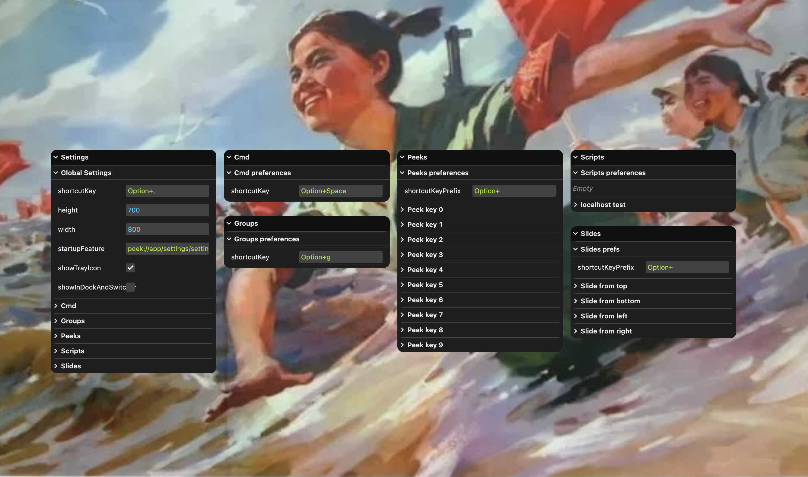

# Peek

Peek is a web user agent application designed for using the web where, when and how you want.

Today's browsers are one-size-fits-all applications, cramming the vast universe of user needs across an unimaginably large web into in an unmodifiable tabbed-window design.

Peek is a web user agent that is a workbench for experimenting with task alignment - making it easy to create new user interface shapes for the web which fit our need in the moment.

We often use the web with a specific goal in mind - that goal should drive the design of the interface of the web user agent.



## Important notes

___PEEK IS NOT A WEB BROWSER___

Peek is not a web browser, and will never be a browser in the way you are probably familiar with: There are no tabs, and no windows in the tabbed-browser-like sense of them. Peek likely does not have many other of many details we are used to in web browsers, but do not notice until they are missing. Peek may be most useful to you if you view it as an entirely different type of application than a traditional web browser.

___PEEK IS A CONCEPT PREVIEW___

Peek is not safe for daily use yet! It is a proof of concept. Do not use it for anything critical. Peek does not have the same security approach as traditional web browsers, and its security model and security user interface have not yet been determined. Peek has not had a security audit.

## Features

You can use Peek in a few ways, with more coming:

- Peeks - Keyboard-activated modal chromeless web pages for quickly glancing at or interacting with pages
- Slides - Keyboard- or gesture-activated modal chromeless web pages which slide in from any screen edges
- Scripts - Scripts periodically executed against a web page in the background which extract data for you to route to other pages or applications, or to aggregate, store and process later

In progress, or thinking about:

- Commands - a graphical command entry palette (GCLI) for opening pages or executing commands against them
- Groups - a way to categorize, recall and interact with groups of pages
- "native" web apps - using Peek as a way to "install" web pages on the local device, as separate applications instead of just separate processes

### Usage

- Settings
  * In app, `Cmd/Ctrl+r,` or launch app to open settings, or click tray icon
  * Configure Peeks/Slides/Scripts in settings
- Peeks
  * `Opt+0-9` to open Peeks
- Slides
  * `Opt+←→↑↓` to open Slides

### Peeks

Peeks are keyboard activated modal chromeless web pages mapped to `Opt+0-9` and closed on blur, the `Escape` key or `cmd/ctrl+w`.

### Slides

Slides are gesture activated modal chromeless web pages which slide in from left/right/bottom/top, and closed on blur, the `Escape` key or `cmd/ctrl+w`.

### Scripts

Scripts periodically load a web page in the background and extract data matching a CSS selector, stores it, and notify the user when the resulting data changes.

Ok, so not really "scripts" yet. But safe and effective enough for now.

## Design

Many user tasks on the web are either transient, chained or persistent, data oriented, or some mix of those. Neither the document-oriented nor application-centric web meets those needs. Traditional browser makers can't meet those needs well, for many reasons.

Characteristics of how we use the web, that are not addressed in contemporary web browsers:

- transient
- chained
- persistent
- data-centric
- archival / evidential

Some thoughts driving the design of Peek:

- Web user agents should be bounded by the user, not browser vendor business models
- Windows and tabs should have died a long time ago, a mixed metaphor constraining the ability of the web to grow/thrive/change and meet user needs
- Security user interface must be a clear articulation of risks and trade-offs, and users should own the decisions

### Escape IZUI

TODO: articulate the escape-to-leave aspect, eg you can peek from *other* applications and ESC to go back to exactly where you were without breaking the task flow.

Escape is an inverted zooming user interface (IZUI) design for a flexible window manager that makes possible a web user agent application than can have multiple entry points and a heterogeneous windowing ecosystem.

IZUI vs ZUI

* ZUIs navigate by starting from a known root and user navigates by zooming ever further in, and then back out
* Escape can enter a window stack at any point, and via a variety of methods, often from outside the application
* Instead of navigating by zooming in, all interfaces can zoom out to go back, using the Escape key
* This design allows unbounded and diverse entry points, but with predictable behavior
* Regardless of the entry point, the user always has a consistent path to familiar ground

Escape navigation model
* navigation base can start at any level in stack
* forward navigations are added on top of stack
* backwards navigations walk the stack in reverse up the tree to the root

## Architecture / Implementation

About this space:

- Web pages can themselves be navigators of the web
- Embrace the app-ness of the web platform, as a way to efficiently access the document-ness
- Decouple html+js+css from http+dns+ssl - not entirely, but that trust+security model is not a required starting point
- Javascript is ok here

Peek is designed to be modular and configurable around the idea that parts of it
can run in different environments.

For example:
- Planning on a mobile app which syncs and runs your peeks/slides/scripts
- I'd like to have a decentralized compute option for running your scripts outside of your clients and syncing the data
- Want cloud storage for all config and data, esp infinite history, so can do fun things with it

### Feature extensibility

An extensibility model for achieving "personal web workbench" requires a few things:
- UI extensibility requires OS-level window features beyond what the web allows today (also a baby step towards a minimal OS user interface)
- Data harvest/transform/process/publish requires a method of moving data between features (web apps) *locally*, cf Web Actions/Intents/Applets, MCP, pubsub, MQTT etc
- Portable ways of accessing network, storage and compute, which address 

The current implementation has only a few sketches of that world implemented, and has gone through a few iterations:
- first proof of concept was all Electron - so, privileged JS
- second experiment moved each feature to a separate web app running in own window scope, with access to smallest possible custom API, with one main web app loading and orchestrating the others, using pubsub for cross-app communication
- third and current implementation bundles all features into one web app, with access to smallest possible custom API for platform-level capabilities

The web app is loaded into custom scheme of `peek`, which provides access to a few special apis noted in the next section, allows cross-origin network access and other things.

This is not ideal, as the extensibility vector is contributions to core, which too tightly bounds experimentation and innovation.

However it's pretty portable given the small custom API surface area.

It would be nice, but not required, to have some alignment with the WebExtension spec - blur your eyes and they're in a similar direction.

### Peek API

Initially the prototype was all Electron. But that's not interesting, and doesn't
really tell us anything about constraints of the web itself.

So instead I asked this question: What's the minimum capability set that a web app would
need to build the features I need?

The answer, so far, is giving `peek` apps the following APIs:

- window open/close
- global hotkey registration
- pubsub messaging

Custom window api might be able to away entirely, by passing window.open features, working on that.

### Desktop App

Proof of concept is Electron. By far the best option today for cross-platform desktop apps which need a web rendering engine. There's really nothing else remotely suited (yet).

User interface:
- the built-in features are all modal chromeless web pages at this point
- settings "apps" are [lil-gui](https://github.com/georgealways/lil-gui) panels

TODO
- Need to look at whether could library-ize some of what Agregore implemented for non-HTTP protocol support.
- Min browser might be interesting as a forkable base to work from and contribute to, if they're open to it. At least, should look more at the architecture.

### Mobile

- Quick access to Script output and manual runs, as widgets (or output from cloud runners?)
- Peeks still totes useful here - on mobile is more like "quick dial" features

### Cloud

- Going full crypto payments for distributed compute on this one.

## Papercut / use-case log

Core high level actions
- open a web page on top/bottom/left/right
- keep web pages persistent in the background
- quickly open a web page modally, and close it

Misc specific
- open bandcamp in a window, move over to 2nd display, accidently close it while moving around between other windows
- recent books or recipes from newsletters i subscribe to (but probably didn't read)
- extract a table from a page periodically, send it somewhere as csv or whatever (chained actions)
- collect microformats, metadata, events
- web page w/ some locations as an input to a map (creates overlay) "map this page"
- be able to see where a book/etc recommendation came from
- save a tweet, with URL / image / relevant text, but not whole page webrecorder style
- "watch local event listings, rate against my music listening patterns and send me shows i might be interested in going to"

Content scripts
- extract+log shazams
- extract+log spotify playlist

Calculators (variant of script + cmd?)
- page -> table
- page -> summary
- page -> microsummaries
- page -> dates
- page -> events

Workflow deconstructing a "why" task flavour of bookmarking
- save https://www.criterionchannel.com/hong-kong-in-new-york
- extract the movies
- get reference metadata for each (?!)
- add to "to watch list", with pointer back to source url

## Groups

- panorama/tabcandy-ish
- all browser history
- smart groups vs curated groups
- autoclustering on topic/date
- escape from a new page enters default group?

Groups + Cmds
- top/bottom inputs for filtering/grouping/etc
- implemented is a cmd input?
- cmds for opening/searching/finding/viewing/filtering/piping
- cmds for moving pages into groups
- groups -> {x} (eg export/pipe) could depend on the chaining/piping bit (see below)

Architecture
- internally is tags?
- static vs dynamic groups tho?

Publishing
- publishing groups as internal/public feeds?
- to pinboard?

## History view/search

A lot of groups work depends on history being in place, and being accessable and annotate-able.

ideally use chromium history

storage+access
- check out Agregore history viewing approach
- check out state of electron+webext
- other way of accessing underlying chromium history?

features
- awesomebar algo scoring
- adaptive matching

## Chaining / piping

investigate: vague thought re chaining:
- dynamic interstitial representations
- mime type detection?
- eg image previews
- or a table of data
- previews of cmds?

interfaces
- horizontal vs vertical chains
- back/forward navigation?
- each step is a cmd+preview?
- dynamic cmd+previews?

import/export/undo/redo
- record/replay?
- save a chain as a compound action (cmd)?

architecture
- look at web actions/intents/applets
- xml pipeline language

## Roadmap

### v0.1 - MVPOC

minimum viable proof of concept.

question: would i use this?

Core moduluarization
- [x] Modularize feature types, eyeing the extensibility model
- [x] move settings window to features/settings

App cleanup
- [x] main window vs settings
- [x] change settings shortcut from global+esc to opt+comma

Window lifecycle
- [x] modularize window open/close + hidden/visible
- [x] update settings, peeks, slides, scripts
- [x] hide/show window vs create fresh
- [x] update slides impl to use openWindow (x, y)

Minimal Electron + Maximal Web
- [x] move features to all web code, with a couple special apis
- [x] make globalShortcut an api like openWindow

Create core app
- [x] core settings
- [x] registers other features

Move all features to web implementation
- [x] move all possible code from the electron file to the web app
- [x] move to web implemented globalShortcut
- [x] move to web implemented openWindow
- [x] move settings re-use code to utils lib
- [x] ability to add clickable links in settings panes
- [x] add links to Settings app
- [x] per-feature settings ui

Core+settings
- [x] move feature list and enablement to storage
- [x] merge core + settings
- [x] enable/disable features
- [x] configurable default feature to load on app open (default to settings)
- [x] wire up tray icon to pref
- [x] tray click opens default app

Core/Basic
- [x] basic command bar to open pages
- [x] fix setting layout wrapping issue

Commands/messaging
- [x] implement pubsub api
- [x] way to tell feature to open default ui (if there is one)
- [x] way tell feature to open its settings ui (if there is one)

Features cleanup
- [x] enable/disable individual slides, peeks
- [x] enable/disable individual scripts

Internal cleanup
- [x] s/guid/id/
- [x] fix label names, match to pwa manifest
- [x] put readable log labels back in

### v0.2 - MVCP (minimum viable concept preview)

minimum viable concept preview.

question: can others try this?

Windows/system
- [x] app showing in dock even tho disabled
- [x] app not showing in tray, even tho enabled
- [x] all api calls get source attached
- [x] window cache s/custom/map/
- [x] window cache all windows not just persistent
- [x] window cache - evaluate key approach (use-case: apps need to identify windows they open)
- [x] always return window id, so apps can manage it
- [x] reimplement keys, so much easier for callers than managing ids
- [x] account for number of renderer processes (seems double?)

redo window system to be more webby
- [x] prototype window.open
- [x] evaluate webContents.setWindowOpenHandler
- [x] stop using openWindow to show pre-existing hidden windows?
  - [x] can track web windows locally
  - [x] can identify web windows on both sides (key/name)
  - [x] add new custom api for windows superpowers
- [x] collapse window opening to span both approaches
- [x] finish converting all openWindow to window.open

Feature lifecycle (un/install and reloads)
- [x] feature unload/reload - init/uninit whole feature and window
- [x] all api calls have address accessible by preload
- [x] close other windows of feature, not just background window

Feature re-init/reload when toggled
- [ ] track shortcuts by source, remove when unloaded
- [ ] main: track window sources
- [ ] main: close child windows when (before) closing source window

Shortcut lifecycle
- [x] main process should handle multiple registrations correctly
- [x] send/track feature id/origin w/ each registration
- [ ] unreg shortcuts on unload

Window features
- [ ] add back in window features to window.open
  - [x] show/hide (keep alive)
  - [x] transparent
- [ ] enable global window resize
- [ ] add draggable as pref

Features clean themselves up for lifecycle events
- [ ] load/unload peeks when enabled/disabled
- [ ] load/unload slides when enabled/disabled
- [ ] load/unload scripts when enabled/disabled

Peeks/Slides
- [x] only register shortcut and create window if a URL is configured
- [ ] unreg shortcuts and close windows on peek un/configure
- [ ] unreg shortcuts and close windows on slides un/configure

Cmd
- [ ] update to latest Cmd extension code
- [ ] app-scoped multi-window pages open

Settings
- [x] fix window size
- [x] transparency
- [ ] core settings re-render on feature toggle, eg feature-settings link enabled
- [ ] default position (size to screen)

Daily driver blockers
- [x] debug vs profile(s) for app dir
- [x] fix ESC not working right
- [x] fix ESC not working in web content
- [x] fix ESC not working right over lil-gui

Dev stuff
- [x] figure out single devtools window if possible

Deployment
- [ ] app updates
- [ ] icons
- [ ] about page

Demo reel
- [ ] Peeks: translate, calendar, ai chat, currency conversion, everytimezone, tldraw
- [ ] Slides: soundcloud, crypto prices, notepad, todo list
- [ ] Scripts: eth price, weather change

### v0.3 - extensibility / history

Backburner wishlist
- [ ] window switching order algo

DX papercuts
- [ ] why crashing on reload main
- [ ] devtools stealing focus
- [ ] unified floating devtools

Window features
- [x] add transparency support to api
- [ ] distentangle transparency and content-fit
- [ ] add the rest of that shit

App mgmt
- [ ] uniform policy for feature id creation (lean on web/extensions)
- [ ] collisions

App dev
- [ ] app model - web? extension? P/IWA? other?
- [ ] shared libs, eg utils
- [ ] language: call them feature or apps? other?

Focus vs not focused app mode
- [ ] openWindow option to not close on escape (perma windows w/ controls)
- [ ] app focus detection in shortcuts
- [ ] separate global shortcuts from app shortcuts (eg quit)
- [ ] all-window show/hide when doing global shortcuts while app unfocused

Install/load/address features
- [x] built-in feature loading from origin not file
- [x] app protocol? webextension? pwa? wtf?
- [ ] combine settings and background in built-in features?
    - eg, features can have default ui + bg services?
- [ ] pull from manifest (load/install via manifest with special key?)
- [ ] manifests for feature metadata
- [ ] feature urls? eg peek://settings(/index.html)
- [ ] feature metadata in manifest
- [ ] move feature bg pages to iframes in core bg page?

Settings
- [ ] make it so start feature can be unset (eh)

Navigation
- [ ] make izui stack manager (part of window mgr?)
- [ ] esc stack: from feature settings back to core settings
- [ ] add to izui stack (and ix w/ history?)

Window animations
- [ ] add window open animation (to/from coords, time) to openWindow
- [ ] update slides impl to use animation again

Window controls/persistence/etc (after perma window)
- [ ] window position persistence where it makes sense (settings, groups, cmd) and make configurable?
- [ ] window size persistence where it makes sense (slides, peeks) and make configurable?
- [ ] window controls
- [ ] window resizers

History
- [ ] push navigations out through pubsub?
- [ ] add history listener + storage to cmd
- [ ] store central app action history
- [ ] store content script data

Feature level rpc?
- [ ] how can other features query history vs store and query locally?
- [ ] how to know what urls there are to open? publish paths in manifests?
- [ ] discover + execute cmds?
- [ ] need to be able to get/set properties from other "features"?

Window layout
- [ ] try with settings maybe?
- [ ] tile/untile

Web Platform
- [ ] need a web loader that's not full BrowserWindow?
- [ ] sandboxing
- [ ] blocklist

After that
- [ ] schema migration
- [ ] Extension model?
- [ ] Ubiquity-like
- [ ] Panorama-like
- [ ] Tray
- [ ] Scratchpad
- [ ] Identity
- [ ] Contacts
- [ ] Collaboration

Further
- [ ] Implement the Firefox "awesomebar" scoring and search algorithm so that Peek *learns* you
- [ ] Extension model designed for web user agent user interface experimentation
- [ ] Infinite lossless personal encrypted archive of web history

## Contribution

- in proto stage
- all dragons, no promises

## Development

```
yarn install
yarn debug
```

## Mobile

- some of the features don't make sense as-is on mobile
- but maybe quick access on mobile to slides/peeks would be nice
- and seeing output of content scripts, or ability to re-run locally on demand
- needs some sync facility (inevitable anyway)

## Demo reel

to add:
- something where i'm in a different app and peek/slide

preview gif
- empty background
- slide-right: start music on hypem.com

- cmd: `search` for 'xiao mian' w/ cmd, click on recipe link
  - add a 'search' command

- copy chinese text
- slide-top: paste to translate into english

- cmd: `images` chongqing xiao mian
- copy image of noodle soup
- slide-down: to open tldraw, paste image

- slide-left: ask chatgpt about how chongqing xiao mian is different from in chengdu

- peek-0: check the weather

- slide-top: get directions to noodle shop

## Use-cases

Peeks
- translate
- calendar
- ai chat
- currency conversion
- everytimezone
- tldraw

Slides
- music: Soundcloud, Hypem
- stock prices
- notepad
- todo list

Scripts
- weather change, eg upcoming weather
- crypto prices

Cmd - web
- open url
- web search
- image search
- conversions?
- ddg !actions

Cmd - system
- search browser history
- set peeks/slides
- open settings
- restart app
- llm prompts

Future
- address something to switch between
- pipe from/to?

Publishing high level
- author web content
- pull in bits from the web
- share preview for feedback
- publish (or at least get output)

Publishing examples
- writing an event recap

Publishing: event recap post
- make a new markdown doc
- sections titled for each video title
- each video's embed code in each section
- navigate around the document for review and updates
- need to easily preview rendered content
- share preview link
- publish (somewhere?)


## Unfiled

Small examples of agency

- users can move, resize, change things to their requirements
  - eg, browsers restrict min-height of a window, but i should be able make as short as i like


## Browser architecture references

Agregore ext protocol impl
- where all are registered: https://github.com/AgregoreWeb/agregore-browser/blob/master/app/protocols/index.js#L74
- how convert the fetch APIs to be compatible with the streaming protocol handler API in electron: https://github.com/AgregoreWeb/agregore-browser/blob/master/app/protocols/fetch-to-handler.js
- where register IPFS: https://github.com/AgregoreWeb/agregore-browser/blob/electron-23/app/protocols/ipfs-protocol.js

Browsers
- Min browser architecture - https://github.com/minbrowser/min/wiki/Architecture
- Dot browser https://www.dothq.org/en-US

## History

In working on Firefox and related things at Mozilla from 2006 - 2019, there were a few specific initiatives which best aligned with my needs as a user on the web:

- The Awesomebar: infinite history + personalized local search index
- Ubiquity: Natural language commands + chaining
- Jetpack: The Mozilla Labs version - web-platfrom-centric extensibility
- Panorama: née TabCandy, web pages as groups instead of tabs in windows

A few others which were in the right direction but didn't achieve their optimal form:

- Greasemonkey
- Microsummaries
- Contacts extension

The first version of the Peek application has some bits of each of these, and the original Peek browser extension.

### Peek browser extension

Peek was a browser extension that let you quickly peek at your favorite web pages without breaking your flow - loading pages mapped to keyboard shortcuts into a modal window with no controls, closable via the `Escape` key.

However, as browser extension APIs became increasingly limited, it was not possible to create a decent user experience and I abandoned it. You can access the extension in this repo [in the extension directory](/autonome/peek/extension/).

The only way to create the ideal user experience for a web user agent that *Does What I Want* is to make it a browser-ish application, and that's what Peek is now.


